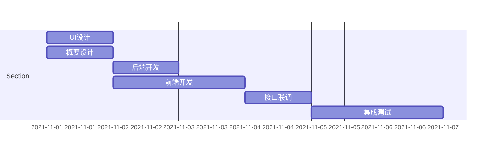

### 背景
在软件开发的系统建模过程中，画图是一项重要且比较耗时的工作。
常用的画图工具有Microsoft Visio, draw.io, processon.com 等。
对于追求效率的程序员而言，使用鼠标拖动的效率始终不如通过一项语言来描述图形, 而mermaid正好提供了这种能力帮助我们快速的绘制系统图形, 并且能够很好地将其文档化。

### 基本介绍

Mermaid是一个基于Javascript的图表和图表工具, 通过定义特定的语法, 自动渲染出一些复杂的软件图形。
该工具在2019年层获得了JS开源奖项中的 "最激动人心的技术"奖项。

目前能够支持的图形类别包括
- 流程图
- 时序图
- 甘特图
- UML类图
- E-R图
- 状态图
- 饼图

官方主页: <https://github.com/mermaid-js/mermaid>
官方教程: <https://mermaid-js.github.io/mermaid/#/>
在线编辑: <https://mermaid-js.github.io/mermaid-live-editor>


### 使用范例

#### 流程图


```
graph LR
B(开始) --> C{进行讨论}
C -->|分支A| D[结果A]
C -->|分支B| E[结果B]
```

#### 时序图


```
sequenceDiagram
Y->>John: Hello 你好吗?
loop 
    John->>John: 对抗抑郁症
end
Note right of John: 理性思考!
John-->>Alice: 挺好!
John->>Bob: 那你咋样?
Bob-->>John: 也挺好的
```

#### 饼状图


#### 画个甘特图


### 工具集成

#### 与Hexo集成
**1.安装渲染插件**
```shell
npm install hexo-filter-mermaid-diagrams
```

**2.修改配置文件**
在根目录下的 \_config.yml 文件添加如下配置

```
# mermaid chart
mermaid: ## mermaid url https://github.com/knsv/mermaid
  enable: true  # default true
  version: "8.13.2" # default v7.1.2 (可更改为最新的RELEASE版本号)
  options:  # find more api options from https://github.com/knsv/mermaid/blob/master/src/mermaidAPI.js
    #startOnload: true  // default true
    theme: forest
```

**3.修改JS文件**
在 /themes/next/layout/\_partials/footer.swig 添加如下代码片段

```

  <script src='https://unpkg.com/mermaid@{{ theme.mermaid.version }}/dist/mermaid.min.js'></script>
  <script>
    if (window.mermaid) {
      mermaid.initialize({{ JSON.stringify(theme.mermaid.options) }});
    }
  </script>

```

#### 与VSCode/Gitlab集成
与VSCode集成的方式也有好多种, 本人使用的是语法高亮插件+Markdown预览的方案, 安装下面两个插件就好了

- Markdown Preview Mermaid Support 
- Mermaid Markdown Syntax Highlighting

集成到VSCode之后, 就可以通过Git来管理项目中的图形文档了
同时在Gitlab里面也是支持Markdown文件直接渲染出图形的

#### 私有化部署live-editor

参考github主页 <https://github.com/mermaid-js/mermaid-live-editor> 使用 docker 方式私有化部署

```
docker run --publish 8000:80 ghcr.io/mermaid-js/mermaid-live-editor
```

### 小结

更进一步的话，也可以探讨一下怎么跟其他的工具链结合起来使用，例如代码生成/文档图形自动生成等